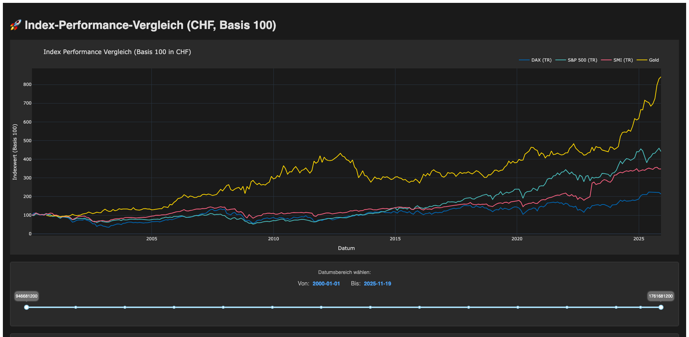

# Index Performance Comparison Chart

A web application for visualizing and comparing the performance of major financial indices and assets, normalized to a base value of 100 in Swiss Francs (CHF). Built with Flask, Dash, and Plotly for interactive data visualization.
## Screenshot


## Features

- **Multi-Asset Comparison**: Compare the performance of DAX (Total Return), S&P 500 (Total Return), SMI (Total Return), and Gold.
- **Currency Normalization**: All indices are converted to CHF for an accurate, direct comparison.
- **Base 100 Scaling**: All assets are normalized to start at 100 for easy relative performance analysis.
- **Interactive Charts**: Built with Plotly for responsive and interactive visualizations with zoom, pan, and hover capabilities.
- **Interactive Date Range Slider**: RangeSlider with two handles and year markings (2000, 2002, 2004, etc.) for easy date selection.
- **Real-time Date Labels**: Selected date range displayed prominently with formatted tooltips during slider interaction.
- **Historical Data**: Accesses data from 2000 to the present.
- **Month-End Data Filtering**: Data points are resampled to month-end values for a cleaner and more readable chart.
- **Performance Statistics**: Automatically calculates and displays total return and Compound Annual Growth Rate (CAGR) for each asset over the selected period.
- **Automatic Updates**: Chart refreshes automatically when slider values change - no manual update button needed.
- **Dark Theme**: Professional dark theme for better readability and reduced eye strain.

## Prerequisites

- Python 3.13 or higher
- A package manager like `pip` or `uv`.

## Installation

1.  **Clone the repository:**
    ```bash
    git clone https://github.com/HelmutQualtinger/Charts.git
    cd Charts
    ```

2.  **Install dependencies:**
    ```bash
    pip install -r requirements.txt
    ```
    *(If you use `uv`, you can run `uv pip install -r requirements.txt`)*

## Usage

### Starting the Server

To start the Dash server, run:
```bash
python3 server.py
```
The server will start on `http://localhost:5000`.

### Accessing the Application

Open your web browser and navigate to:
```
http://localhost:5000
```

### Using the Interface

1.  **Initial Load**: The chart loads automatically when you open the page, showing the full date range (2000 to present).
2.  **Adjust Date Range**: Use the interactive RangeSlider below the chart to select your desired start and end dates:
    - Drag the left handle to change the start date
    - Drag the right handle to change the end date
    - Year markings (2000, 2002, 2004, etc.) help with orientation
    - Human-readable dates appear in tooltips while dragging
3.  **Automatic Update**: The chart updates automatically when you release the slider handles.
4.  **Interact with the Chart**:
    - Hover over data points to see their exact values
    - Click and drag to zoom into a specific area
    - Double-click to reset zoom
    - Click on legend items to hide or show specific assets
5.  **View Statistics**: Performance statistics (Total Return and CAGR) are displayed below the slider for each asset.

## How It Works

### Data Sources

The application fetches real-time and historical financial data from Yahoo Finance using the `yfinance` library. The following tickers are used:

-   **DAX**: `^GDAXI` (Total Return)
-   **SMI**: `SMIC.SW` (Total Return) - hardcoded data as it's not available on yfinance
-   **S&P 500**: `^SP500TR` (Total Return)
-   **Gold**: `GC=F` (Gold Futures)
-   **Exchange Rates**: `EURCHF=X` and `USDCHF=X` for currency conversion.

### Data Processing

All data processing is done **server-side in Python**:

1.  **Fetch**: The backend fetches historical data for all tickers from Yahoo Finance using `yfinance`.
2.  **Convert**: The DAX (EUR) and S&P 500 / Gold (USD) values are converted to CHF using the daily exchange rates.
3.  **Filter**: The data is filtered by the selected date range.
4.  **Resample**: Data is resampled to month-end dates only using pandas' `resample('ME')`.
5.  **Forward Fill**: Missing values are forward-filled to ensure continuous data.
6.  **Normalize**: All asset values are scaled to a base of 100, starting from the first valid value for each index.
7.  **Calculate Statistics**: CAGR and total return are computed for each asset.
8.  **Visualize**: The processed data is sent to the frontend and rendered as an interactive Plotly line chart.

### Reactivity

The application uses **Dash callbacks** for reactive updates:
- When the slider changes, a callback fetches and processes the data
- The chart and statistics update automatically
- Clientside JavaScript callback formats tooltip dates in real-time
- No page reloads or manual button clicks required

## Project Structure

```
Charts/
├── server.py         # Flask + Dash application (data fetching, processing, and UI)
├── smic.py           # Hardcoded SMI data (not available on yfinance)
├── requirements.txt  # Python dependencies
├── CLAUDE.md         # Development guidance for Claude Code
├── README.md         # This file
└── proxy.py          # Legacy proxy server (not used with Dash)
```

## Technical Details

### Backend (`server.py`)

-   **Framework**: Flask + Dash
-   **Data Library**: `yfinance` for fetching data from Yahoo Finance
-   **Charting**: Plotly for interactive visualizations
-   **Data Processing**: pandas for currency conversion, resampling, and normalization
-   **Key Functions**:
    -   `fetch_all_data()`: Fetches all ticker data from yfinance
    -   `process_and_scale_data()`: Converts to CHF, filters, and normalizes
    -   `calculate_statistics()`: Computes CAGR and total return
    -   `generate_slider_marks()`: Creates year markings for the slider
-   **Callbacks**:
    -   Date label update (Python)
    -   Tooltip formatting (JavaScript clientside)
    -   Chart update (Python)

### Frontend (Generated by Dash)

-   **Charting Library**: Plotly (via Dash Core Components)
-   **UI Components**:
    -   `dcc.Graph` for the interactive chart
    -   `dcc.RangeSlider` for date range selection with year markings
    -   `dcc.Loading` for loading indicators
-   **Theme**: Dark theme with custom styling (#1a1a1a background)
-   **Reactivity**: Dash callbacks handle all updates automatically

### Key Advantages of Dash/Plotly Implementation

1. **Server-side Processing**: All data manipulation happens in Python, leveraging pandas' powerful data processing capabilities
2. **Type Safety**: Python's type system reduces errors compared to JavaScript
3. **Code Reusability**: Same language (Python) for both backend and frontend logic
4. **Better Performance**: Heavy computations done server-side
5. **Easier Maintenance**: Single codebase, no need to synchronize logic between frontend and backend
6. **Rich Interactivity**: Plotly provides advanced chart interactions out of the box

## Dependencies

- Flask >= 3.0.0
- yfinance >= 0.2.0
- pandas >= 2.0.0
- dash >= 2.14.0
- plotly >= 5.18.0

## Development

See [CLAUDE.md](CLAUDE.md) for detailed development guidance, including:
- Architecture overview
- Key implementation details
- Common modifications
- Code structure

## License

This project is open source and available for educational purposes.
